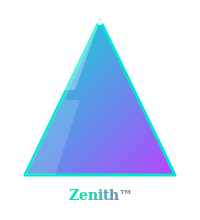

# 🤝 Contribuir a Zenith Crea Ofertas™

<p align="center">
  
</p>

> *De la cima se ve mejor el avatar.*

¡Bienvenido! Si estás aquí es porque quieres aportar valor al sistema de creación de ofertas TOP 1%. Antes de hacer cualquier PR · lee este documento entero. Te ahorrará rebotes y maximizará la probabilidad de que tu cambio entre en `main`.

---

## 📑 Tabla de contenidos

1. [Quick start para contribuidores](#-quick-start-para-contribuidores)
2. [Reglas innegociables del proyecto](#-reglas-innegociables-del-proyecto)
3. [Estructura del proyecto](#-estructura-del-proyecto)
4. [Cómo añadir un agente](#-cómo-añadir-un-agente)
5. [Cómo añadir un slash command](#-cómo-añadir-un-slash-command)
6. [Cómo añadir un knowledge file](#-cómo-añadir-un-knowledge-file)
7. [Cómo modificar un HTML template](#-cómo-modificar-un-html-template)
8. [Estilo de commits](#-estilo-de-commits)
9. [Tests y validación](#-tests-y-validación)
10. [Qué NO se acepta](#-qué-no-se-acepta)
11. [Reconocimiento](#-reconocimiento)

---

## 🚀 Quick start para contribuidores

```bash
# 1. Fork el repo en GitHub
# 2. Clónalo en local
git clone https://github.com/TU-USUARIO/zenith-crea-ofertas.git
cd zenith-crea-ofertas

# 3. Crea una rama descriptiva
git checkout -b feat/loops-mentales-agent
# o
git checkout -b fix/nombre-chicle-emoji-bug

# 4. Haz tus cambios respetando las reglas innegociables (ver abajo)

# 5. Prueba en local
#    - Crea una carpeta vacía /tmp/test-zenith
#    - Apunta el plugin a tu fork
#    - Ejecuta el agente o comando que tocas
#    - Valida el HTML imprimiéndolo a PDF
#    - Pasa el auditor-completo

# 6. Commit siguiendo Conventional Commits
git add agents/42-loops-mentales-architect.md
git commit -m "feat(agents): add loops-mentales-architect for cross-section curiosity gaps"

# 7. Push y PR
git push -u origin feat/loops-mentales-agent
# Abre PR usando la plantilla y rellena el checklist innegociable
```

⏱️ **Tiempo medio de review** · 5-7 días hábiles.

---

## 🔒 Reglas innegociables del proyecto

Toda contribución debe respetar las **10 reglas innegociables** del Método Zenith™. Si tu PR rompe alguna · será rechazado sin debate.

| #  | Regla                                                                        | Por qué                                    |
|----|------------------------------------------------------------------------------|--------------------------------------------|
| 1  | **Cada agente · UNA función.** Si solapa con otro · refactoriza · no dupliques. | Separación de responsabilidades.           |
| 2  | **One Belief siempre 4 variantes** (V1/V2/V3/V4).                            | El framework lo exige.                     |
| 3  | **Mecanismo siempre desdoblado** · Problema + Solución.                      | Imposible vender solo problema o solución. |
| 4  | **HTML siempre print-to-PDF**. Cmd+P debe generar PDF aceptable.             | Output entregable al cliente.              |
| 5  | **Sin discovery · no se ejecuta nada**. Cada agente lee `brief.json`.        | Coherencia entre etapas.                   |
| 6  | **Bencivenga manda al final** · Beneficio + Credibilidad − Costo.            | Fórmula maestra de valor percibido.        |
| 7  | **Schwartz audita** · nivel + stage en outputs.                              | Sin esto el copy es genérico.              |
| 8  | **Carpetas estéticas** · estructura `00-12` numerada.                        | Orden visual = orden mental.               |
| 9  | **Identidad vs Anti-identidad SIEMPRE en pareja.**                           | Una sin la otra no convierte.              |
| 10 | **Naming TOP.** Sin nombres aburridos · usa la fórmula del chicle.           | El nombre vende antes que el copy.         |

---

## 🗂️ Estructura del proyecto

```
zenith-crea-ofertas/
├── .claude-plugin/
│   └── plugin.json              # Metadatos oficiales del plugin
├── .github/
│   ├── FUNDING.yml
│   ├── ISSUE_TEMPLATE/          # bug · feature · agent_proposal
│   ├── PULL_REQUEST_TEMPLATE.md
│   └── workflows/
│       └── validate.yml         # GitHub Action · CI
├── agents/                      # 41 agentes (uno por archivo .md)
│   ├── 01-discovery-master.md
│   ├── 02-punto-a-b-architect.md
│   └── ...
├── commands/                    # 17 slash commands
│   ├── crea-oferta-1pct.md
│   ├── zenith-crea-oferta.md
│   └── ...
├── templates/                   # 18 HTML templates print-to-PDF
│   ├── 00-brief.html
│   ├── _zenith-brand.html       # Design system shared
│   └── ...
├── knowledge/                   # 20 knowledge files (Schwartz · Bencivenga · etc.)
│   ├── schwartz-5-niveles-consciencia.md
│   └── ...
├── examples/                    # Ofertas canónicas resueltas (mínimo 250 líneas)
├── assets/                      # Logos · banner · diagramas SVG
├── docs/                        # Documentación extendida
├── install.sh / install.ps1     # Instalación cross-platform
├── README.md · INSTALL.md · SKILL.md · etc.
└── plugin_detailed.json
```

---

## 🤖 Cómo añadir un agente

Antes de programar **abre una issue** con la plantilla `🤖 Propuesta de nuevo agente` y espera el OK. Si el agente solapa con uno existente · será rechazado.

### Pasos

1. **Crea el archivo** con el siguiente número de etapa:
   ```bash
   touch agents/42-loops-mentales-architect.md
   ```

2. **Usa el formato canónico** (basado en `01-discovery-master.md`):
   ```yaml
   ---
   name: loops-mentales-architect
   description: 100-200 palabras describiendo función única · framework aplicado · output esperado · cuándo invocarlo. Sin esto Claude no sabrá cuándo lanzarlo automáticamente.
   allowed-tools: Read, Grep, Write, Bash
   model: opus
   ---

   # loops-mentales-architect · Tagline corto que enganche

   ## 🧠 QUIÉN SOY
   <!-- Persona del agente · su mentalidad · su expertise -->

   ## ⏰ CUÁNDO ME INVOCAS
   <!-- Casos exactos · ej: tras output-architect · antes de auditor-completo -->

   ## 📚 CONOCIMIENTO QUE CONSULTO
   <!-- Knowledge files que LEE antes de actuar -->

   ## 🔧 EL PROCESO PASO A PASO
   <!-- Numerado · sin ambigüedad -->

   ## 📤 OUTPUT (con ejemplo JSON real)
   ```json
   {
     "loops": [...]
   }
   ```

   ## 🔒 REGLAS INNEGOCIABLES
   <!-- 3-5 reglas que el agente NO puede romper -->

   ## ❌ ANTI-PATRONES
   <!-- Lo que NUNCA debe hacer -->

   ## 🎬 EJEMPLO DE EJECUCIÓN
   <!-- Caso real completo -->

   ## 🔗 INTEGRACIÓN CON OTROS AGENTES
   <!-- Quién le pasa input · a quién le pasa output -->
   ```

3. **Actualiza** los contadores en:
   - `README.md`
   - `SKILL.md`
   - `plugin_detailed.json`

4. **Añade entrada** en `CHANGELOG.md`.

5. **Test local**:
   - Lanza el agente con un brief de prueba.
   - Verifica output JSON.
   - Pasa `auditor-completo` y comprueba que el score global no baja.

6. **PR** usando la plantilla.

### Naming

- `kebab-case` siempre.
- Empieza por número de etapa (`42-`) si entra en pipeline.
- Sin número si es agente lateral / utility.
- Nombre descriptivo · no aburrido (regla #10).

---

## ⚡ Cómo añadir un slash command

Abre primero una issue justificando:
- Qué agentes lanza.
- Caso de uso específico.
- Por qué no basta con los 17 existentes.

### Formato canónico (`commands/<nombre>.md`)

```yaml
---
description: Una línea descriptiva que aparecerá en `/help`.
allowed-tools: Read, Bash, Write, Task
---

# /<nombre> · Tagline

## Qué hace
<!-- Comportamiento end-to-end -->

## Agentes que lanza
1. `34-zenith-quick-discovery`
2. `35-avatar-deep-psicologo`
3. ...

## Output esperado
<!-- Estructura de archivos generados -->

## Cuándo usarlo
<!-- vs otros comandos similares -->
```

---

## 📚 Cómo añadir un knowledge file

Abre issue indicando:
- Autor · libro · página.
- Aplicación práctica en la skill.
- Qué agentes lo consultarán.

### Reglas

- **Cita la fuente siempre** (sin fuente · no se acepta).
- Formato Markdown bien estructurado · con headings y ejemplos.
- Mínimo 200 líneas si es framework central · 100 si es ampliación.
- Naming · `<autor>-<concepto>.md` (ej. `halbert-power-words.md`).
- Después de añadir · referénciarlo desde el/los agentes que lo consultan en la sección **`📚 CONOCIMIENTO QUE CONSULTO`**.

---

## 🎨 Cómo modificar un HTML template

### Reglas no negociables

- **Mantén el design system intacto**. Variables CSS · tipografías · colores → todo se hereda de `templates/_zenith-brand.html` y de `templates/css/`.
- **Test print-to-PDF** en:
  - Chrome (último estable)
  - Safari (último macOS)
  - Firefox (último estable)
- **Mobile-first responsive** · aunque el PDF sea siempre A4 · el preview en navegador debe verse correcto.
- **Sin librerías externas** · todo el CSS y el HTML debe ser self-contained · sin CDN (porque puede no estar disponible al imprimir).
- **Sin JavaScript** que no sea estrictamente decorativo · y siempre que se pueda · prescindir de él.

### Variables CSS canónicas

```css
:root {
  --zenith-cyan: #00E5CF;
  --zenith-purple: #B845FF;
  --zenith-bg-dark: #050510;
  --zenith-bg-soft: #0B0B17;
  --zenith-text: #ffffff;
  --zenith-text-muted: #c5c5d4;
  --zenith-text-dim: #777788;
  --zenith-font-serif: Georgia, 'Times New Roman', serif;
  --zenith-font-mono: ui-monospace, 'SF Mono', monospace;
}
```

Usa estas variables en cualquier nuevo template. Si introduces un color o tipografía nueva · justifícalo en el PR.

---

## 📝 Estilo de commits · Conventional Commits

Usamos **[Conventional Commits](https://www.conventionalcommits.org/)** estrictamente. El changelog se genera (en parte) automáticamente desde estos commits.

### Formato

```
<type>(<scope>): <descripción imperativa en presente · minúscula · sin punto>

[cuerpo opcional · explicando el por qué]

[footer opcional · BREAKING CHANGE · Closes #123]
```

### Tipos válidos

| Type        | Cuándo                                                   |
|-------------|----------------------------------------------------------|
| `feat`      | Nueva feature · agente · command · template              |
| `fix`       | Arregla un bug                                           |
| `docs`      | Solo documentación (README · CONTRIBUTING · etc.)        |
| `style`     | Cambios de formato · sin lógica (espacios · indentación) |
| `refactor`  | Refactor sin cambio funcional                            |
| `perf`      | Mejora de rendimiento                                    |
| `test`      | Añadir o corregir tests                                  |
| `chore`     | Tareas de mantenimiento (deps · build · CI)              |
| `revert`    | Revierte un commit anterior                              |

### Scopes recomendados

`agents` · `commands` · `templates` · `knowledge` · `examples` · `docs` · `ci` · `install` · `brand`

### Ejemplos buenos

```
feat(agents): add loops-mentales-architect for cross-section curiosity gaps
fix(templates): repair print-to-PDF page break in 10-oferta-completa.html
docs(readme): update agent count to 42 after new agent
refactor(knowledge): split schwartz file into 5-niveles and 5-stages
chore(ci): add markdown lint to validate workflow
```

### Ejemplos malos

```
update stuff               ❌ sin type · sin scope · vago
FEAT: New agent.           ❌ mayúscula · punto · sin scope · imperativo roto
fix bug                    ❌ sin tipo · sin descripción concreta
```

---

## 🧪 Tests y validación

No tenemos suite automatizada de tests unitarios (es un plugin de prompts · no de código tradicional) · pero exigimos un **smoke test manual completo** antes de cada PR:

### Checklist de validación

```
[ ] He clonado mi fork en una carpeta limpia.
[ ] He ejecutado `/setup-crea-ofertas` desde cero.
[ ] He generado una oferta completa con `/crea-oferta-1pct` o el comando que tocas.
[ ] El output JSON es válido (parse OK).
[ ] El HTML generado imprime a PDF en Chrome sin romper layout.
[ ] El `auditor-completo` da score igual o superior al benchmark previo.
[ ] He revisado el diff con `git diff` y no se ha colado nada raro (.DS_Store · .env · credenciales).
[ ] El CI pasa (validate JSON · markdown lint · count assets).
```

### CI · GitHub Actions

El workflow `.github/workflows/validate.yml` ejecuta automáticamente en cada PR:

1. **JSON validation** · todos los `.json` deben parsear.
2. **Markdown lint** · estructura · enlaces · tablas.
3. **HTML syntax check** · tidy sobre `templates/*.html`.
4. **Count assets** · agentes / commands / templates / knowledge coinciden con README.

Si el CI falla · arregla y vuelve a empujar. No mergeamos PRs con CI rojo.

---

## ❌ Qué NO se acepta

- Agentes que dupliquen funcionalidad de otro existente.
- HTMLs que rompan el design system o el print-to-PDF.
- Knowledge files con afirmaciones sin fuente citada.
- Examples con placeholders sin rellenar (`<TODO>` · `<lorem ipsum>`).
- PRs sin issue previa justificándolos (excepto fixes triviales · typos).
- Commits que no sigan Conventional Commits.
- PRs que toquen 20 cosas a la vez. **Un PR · un cambio lógico.**
- Cambios estéticos al branding (cyan + purple) sin discusión previa.
- Introducción de dependencias externas (Node modules · librerías JS · CDN).

---

## 🤝 Código de conducta

Esta comunidad sigue el **[`CODE_OF_CONDUCT.md`](./CODE_OF_CONDUCT.md)** (adaptado del Contributor Covenant v2.1).

Al contribuir · aceptas respetarlo. Comportamientos abusivos llevan a expulsión.

---

## 🌟 Reconocimiento

Los contribuidores aceptados aparecen en:

- `CONTRIBUTORS.md` (lista oficial).
- Mención en el `CHANGELOG.md` de la release correspondiente.
- Si tu contribución es estructural · se cita en el `README.md`.

---

## 📞 Contacto

- **Issues** · [GitHub Issues](https://github.com/zenithmetodo/zenith-crea-ofertas/issues)
- **Discusiones generales** · [GitHub Discussions](https://github.com/zenithmetodo/zenith-crea-ofertas/discussions)
- **Security** · ver [`SECURITY.md`](./SECURITY.md)
- **Email (último recurso)** · `impactodigitalformacionbrasil@gmail.com`

---

> *"Una oferta del 1% no se inventa — se construye por capas · con un agente crack en cada capa. Y cuando contribuyes · eres uno de esos cracks. Bienvenido a la cima."*

---

*Hecho con Método Zenith™ · cada contribución es una piedra más en la cima.*
