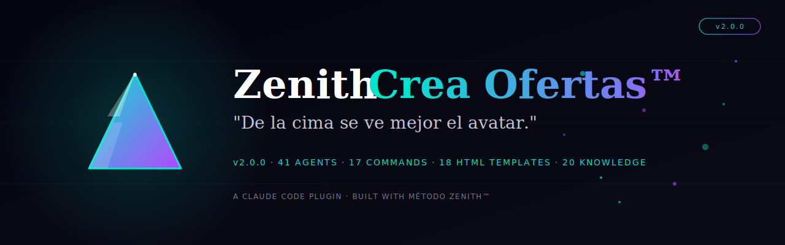
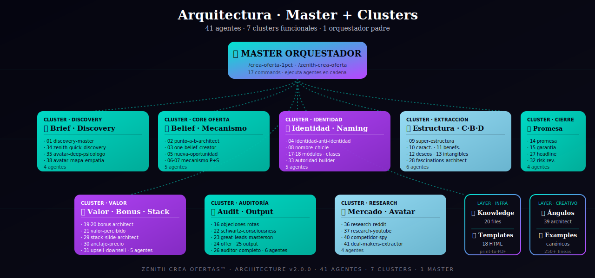
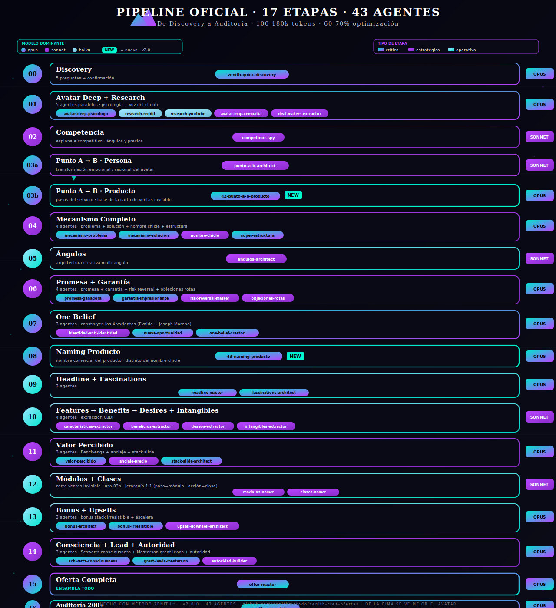

# Zenith Crea Ofertas™ · Plugin Claude Code

<div align="center">



[](https://github.com/zenithmetodo/zenith-crea-ofertas/releases/tag/v2.0.0) []() [](LICENSE)

[]() []() []() []() []() []()

**`/zenith-crea-ofertas:zenith-quick-discovery` · 49 agentes · 19 commands · 19 HTMLs print-to-PDF · 29 knowledge files**

</div>


Sistema completo de agentes Claude Code para construir **OFERTAS TOP 1%** de alto valor percibido en español de España. **Creado por Josep · Método Zenith™** a partir de los frameworks canónicos del Direct Response (Schwartz · Masterson · Bencivenga · Evaldo · Todd Brown · Hormozi · Brunson · Halbert · Sugarman · Cialdini) + transcripciones operativas del autor.

Un orquestador padre coordina **49 sub-agentes especializados** (Opus/Sonnet/Haiku optimizado) + **29 knowledge files** + **19 templates HTML** print-to-PDF + Drive-friendly. El proyecto arranca con una **pre-fase guiada por especificación** (`spec-architect` enmarca → `spec-reviewer` audita por severidad 🔴🟠🟡🟢 → **validación humana** → `plan-architect` hace el plan.md de todo + research). Después, cada agente domina una pieza del puzzle: desde el avatar deep (psicólogo + Reddit + YouTube) hasta la auditoría de 200+ ítems de la oferta final. El bloque 03 (mecanismo) lo lidera **`mecanismo-maestro`**, que pregunta 9 bloques primero y construye 6 piezas cargando la **Biblia del Mecanismo** (131 formaciones destiladas).

> *"De la cima se ve mejor el avatar."*

---

## Instalación

```bash
claude /plugin install https://github.com/zenithmetodo/zenith-crea-ofertas
```

Después de instalar:

```bash
# El orquestador padre — punto de entrada recomendado
/zenith-crea-ofertas:zenith-quick-discovery

# O lanza el pipeline completo
/zenith-crea-ofertas:zenith-crea-oferta

# O invoca un agente concreto directamente
@agent-zenith-crea-ofertas:one-belief-creator
@agent-zenith-crea-ofertas:avatar-deep-psicologo
@agent-zenith-crea-ofertas:angulos-architect
```

### Para transcribir vídeos del usuario (opcional · requiere Whisper)

```bash
bash install.sh        # macOS / Linux
.\install.ps1          # Windows (PowerShell admin)
```

Esto instala Python + ffmpeg + Whisper + jq + BeautifulSoup automáticamente.

---

## 🚀 Cómo empezar · 4 modos de uso

Tienes **4 formas distintas** de usar la skill según tu nivel de control:

### Modo 1 · 🏔️ PIPELINE COMPLETO (recomendado primera vez)

Lanza las 17 etapas en cascada · una sola orden y recibes todo el embudo.

```bash
/zenith-crea-ofertas:zenith-crea-oferta
```

→ Discovery (5 preguntas) → confirmación → **17 etapas automáticas** → carpeta `proyecto-{slug}/` con **22+ HTMLs** estéticos imprimibles a PDF.
**⏱️ Tiempo:** 60-90 min · **💰 Coste:** **Incluido en tu plan Claude (Pro $20 · Max $100 · Max $200)** · _Ref API pay-per-use: ~$1.50-3.00 por pipeline completo (100-180k tokens)_

---

### Modo 2 · 🎯 SOLO DISCOVERY (control manual del flujo)

Si quieres **decidir tú mismo** qué etapa lanzar después del brief:

```bash
/zenith-crea-ofertas:zenith-quick-discovery
```

→ Solo te hace las 5 preguntas y genera el brief. Luego TÚ decides qué lanzar:

```bash
# Después del discovery, lanzas las etapas que quieras, en el orden que quieras:
/zenith-crea-ofertas:avatar-deep         ← etapa 01 · avatar completo
/zenith-crea-ofertas:research-mercado    ← etapa 01 · Reddit + YouTube
/zenith-crea-ofertas:competidor          ← etapa 02 · competencia
/zenith-crea-ofertas:mecanismo           ← bloque 03 · mecanismo (carpeta 03-mecanismo)
/zenith-crea-ofertas:angulos             ← etapa 05 · ángulos
/zenith-crea-ofertas:promesa             ← etapa 06 · promesa ganadora
/zenith-crea-ofertas:garantia            ← etapa 06 · garantía + risk reversal
/zenith-crea-ofertas:one-belief          ← etapa 07 · 4 variantes
/zenith-crea-ofertas:bonus               ← etapa 13 · bonus + irresistible
/zenith-crea-ofertas:modulos             ← etapa 12 · módulos + clases
/zenith-crea-ofertas:valor-percibido     ← etapa 11 · Bencivenga
/zenith-crea-ofertas:schwartz-level      ← auditoría consciencia
/zenith-crea-ofertas:great-leads         ← elige tipo de lead
/zenith-crea-ofertas:audit-oferta        ← etapa 16 · auditor 200+
```

→ **Ventaja:** controlas tokens y haces solo lo que necesites.

---

### Modo 3 · 🤖 INVOCAR AGENTE CONCRETO (máximo control)

Si ya tienes el brief y solo necesitas UN agente específico:

```bash
@agent-zenith-crea-ofertas:avatar-deep-psicologo
@agent-zenith-crea-ofertas:one-belief-creator
@agent-zenith-crea-ofertas:angulos-architect
@agent-zenith-crea-ofertas:headline-master
@agent-zenith-crea-ofertas:auditor-completo
```

→ **Ventaja:** mínimo gasto · útil para iteraciones rápidas o cuando ya tienes el avatar/mecanismo definido.

---

### Modo 4 · 🔍 AUDITAR OFERTA YA EXISTENTE

Si ya tienes una oferta hecha y quieres saber qué falla:

```bash
/zenith-crea-ofertas:audit-oferta
```

→ Te pide la URL o pega del copy · audita 200+ ítems · score · roadmap de fixes rojo/ámbar/verde · veredicto luz-verde/amarilla/roja para tráfico.

---

### 📐 Comparativa de los 4 modos

| Modo | Tiempo | Tokens aprox | Para qué |
|---|---|---|---|
| **1 · Pipeline completo** | 60-90 min | 100-180k | Primera oferta desde cero |
| **2 · Discovery + manual** | 5 min + lo que decidas | 2-150k según etapas | Iterar con control |
| **3 · Agente concreto** | 2-10 min | 2-10k | Tareas puntuales |
| **4 · Auditar existente** | 10-15 min | 8-12k | Diagnóstico de oferta |

---

### 💡 Mi recomendación según tu caso

| Tu situación | Modo recomendado |
|---|---|
| Primera vez con el plugin | Modo 1 (pipeline completo) |
| Ya tienes producto + avatar definidos | Modo 2 (solo etapas que faltan) |
| Solo necesitas afinar 1 pieza | Modo 3 (agente concreto) |
| Tu oferta no convierte | Modo 4 (auditar) |

---

### 💰 Coste del plugin

**Si pagas plan Claude flat (Pro · Max):**

| Plan Claude | Coste | Uso del plugin |
|---|---|---|
| **Pro** | $20/mes | Incluido · suficiente para 5-10 ofertas/mes |
| **Max** | $100/mes | Incluido · uso intenso · agencia |
| **Max** | $200/mes | Incluido · uso extremo · multi-proyecto |

✅ **Sin coste adicional por uso del plugin** · todo dentro de tu plan flat
✅ **Sin sorpresas a fin de mes** · sabes exactamente lo que pagas
✅ **Servicios externos opcionales:** Apify Free $5/mes (suficiente uso normal)

### Si pagas API pay-per-use (referencia)
- Pipeline completo (Modo 1): ~$1.50-3.00 por oferta
- Modo 2-4 (parcial): ~$0.30-1.50 según etapas
- Servicios externos opcionales: ver [EXTERNAL_SERVICES.md](EXTERNAL_SERVICES.md)

---

## Arquitectura

<div align="center">



*Un orquestador padre coordina los 49 sub-agentes especializados, agrupados por bloque funcional.*

</div>

<details>
<summary>Ver diagrama ASCII (alternativa)</summary>

```
┌────────────────────────────────────────────────────────────────────┐
│                  zenith-quick-discovery (PADRE)                    │
│  5 preguntas críticas + confirmación obligatoria antes de ejecutar │
│  Pipeline 17 etapas · 100-180k tokens · optimización 60-70%        │
└────────────────────────────────────────────────────────────────────┘
                                 │
   ┌──────────┬────────┬─────────┴────────┬────────────┬──────────┐
   ▼          ▼        ▼                  ▼            ▼          ▼
AVATAR     RESEARCH  COMPETENCIA     ONE BELIEF    MECANISMO   OFERTA
   │          │         │                │             │           │
┌──┴───┐  ┌───┴──┐  ┌───┴────┐    ┌──────┴────┐ ┌──────┴──┐  ┌────┴───┐
│deep  │  │reddit│  │spy meta│    │ creator   │ │ problema│  │master  │
│mapa  │  │youtube│ │ad-libry│    │ identidad │ │ solucion│  │auditor │
│deal  │  └──────┘  └────────┘    │ oportunidad│ │ chicle  │  │headline│
│makers│                          │ angulos    │ │ super-est│ │fascina │
└──────┘                          └───────────┘ └──────────┘  │stack   │
                                                              │valor   │
                                                              │bonus   │
                                                              │garantía│
                                                              │módulos │
                                                              │upsell  │
                                                              │autorid │
                                                              └────────┘
```

</details>

---

## Pipeline completo (pre-fase + 17 etapas · 47 agentes)

<div align="center">



*Cada etapa con sus agentes y output HTML correspondiente · orden estricto de ejecución.*

</div>

| # | Etapa | Agentes implicados | Output HTML |
|---|---|---|---|
| **PRE** ⭐ | **Spec → Review → Validación humana → Plan** (gate guiado por especificación antes de gastar tokens) | `spec-architect` · `spec-reviewer` (severidad 🔴🟠🟡🟢) · `plan-architect` | `00-spec/` (spec.md · spec-review.md · plan.md · research-plan.md) |
| **00** | Discovery (5 preguntas + confirmación) | `zenith-quick-discovery` | `00-brief.html` |
| **01** | **Avatar Deep + Research** (5 agentes paralelos) | `avatar-deep-psicologo` · `research-reddit` · `research-youtube` · `avatar-mapa-empatia` · `deal-makers-extractor` | `12-avatar-deep.html` + `13-research-mercado.html` + `16-deal-makers.html` |
| **02** | Competencia (Meta Ad Library + GAP) | `competidor-spy` | `15-competencia.html` |
| **03a** | **Punto A→B PERSONA** (transformación emocional/racional) | `punto-a-b-architect` | `01-punto-a-b.html` |
| **03b** | 🆕 **Punto A→B PRODUCTO** (pasos del servicio · base carta ventas invisible) | `42-punto-a-b-producto` | `17-punto-a-b-producto.html` |
| **03** | ⭐ **Mecanismo MAESTRO** (pregunta 9 bloques primero · carga la Biblia del Mecanismo · construye 6 piezas) | `mecanismo-maestro` (líder) · `mecanismo-problema` · `mecanismo-solucion` · `nombre-chicle` · `objeto-brillante` · `mito-origen` · `super-estructura` | `03-mecanismo/` (MD + HTML gigante por pieza) |
| **05** | Ángulos (definición exacta Joseph Moreno) | `angulos-architect` | `14-angulos.html` |
| **06** | Promesa + Garantía + Risk Reversal | `promesa-ganadora` · `garantia-impresionante` · `risk-reversal-master` · `objeciones-rotas` | `05-promesa.html` + `06-garantia.html` |
| **07** | **One Belief** (3 agentes · 4 variantes) | `identidad-anti-identidad` · `nueva-oportunidad` · `one-belief-creator` | `02-one-belief.html` |
| **08** | 🆕 **Naming Producto** (nombre comercial del programa) | `43-naming-producto` | (integra en `03-mecanismo.html` debajo del nombre chicle) |
| **09** | Headline + Fascinations | `headline-master` · `fascinations-architect` | (integra en oferta completa) |
| **10** | Features → Benefits → Desires + Intangibles | `caracteristicas-extractor` · `beneficios-extractor` · `deseos-extractor` · `intangibles-extractor` | `04-features-benefits-desires.html` |
| **11** | Valor Percibido (Bencivenga) | `valor-percibido` · `anclaje-precio` · `stack-slide-architect` | `09-valor-percibido.html` |
| **12** | Módulos + Clases (carta ventas invisible · usa 03b) | `modulos-namer` · `clases-namer` | `07-modulos-clases.html` |
| **13** | Bonus + Upsells | `bonus-architect` · `bonus-irresistible` · `upsell-downsell-architect` | `08-bonus.html` |
| **14** | Consciencia + Lead + Autoridad | `schwartz-consciousness` · `great-leads-masterson` · `autoridad-builder` | (integra en oferta + auditoría) |
| **15** | **Oferta Completa** ensamblada | `offer-master` | **`10-oferta-completa.html`** ← la página de ventas |
| **16** | Auditoría 200+ ítems | `auditor-completo` | `11-auditoria.html` |

### 🔑 Aclaración sobre los 2 tipos de Punto A→B

| Tipo | Para qué sirve | Agente | Output |
|---|---|---|---|
| **03a · PERSONA** | Transformación EMOCIONAL/RACIONAL del avatar · cómo siente/piensa/hace antes vs después (ej: "vergüenza al espejo" → "se mira y le gusta") | `punto-a-b-architect` | `01-punto-a-b.html` |
| **03b · PRODUCTO** | PASOS OPERATIVOS del servicio · qué hace EL VENDEDOR con el cliente desde contratación hasta resultados (ej: "1.Onboarding · 2.Llamada · 3.Análisis IA · 4...") · base de la **carta de ventas invisible** | `42-punto-a-b-producto` | `17-punto-a-b-producto.html` |

### 🔑 Aclaración sobre los 2 tipos de Naming

| Tipo | Para qué sirve | Agente | Cuándo se ejecuta |
|---|---|---|---|
| **Nombre del MECANISMO** (chicle) | El "cómo" técnico · 2-3 palabras misteriosas (ej: "Yoga en silla", "Monjaro de pobre", "Código Apex") | `nombre-chicle` | Bloque 03 (dentro del mecanismo) |
| **Nombre del PRODUCTO** (comercial) | El "qué" se vende · programa completo (ej: "Bumbum na Nuca Challenge", "Padre Definido 90", "Método Cima") | `43-naming-producto` | Etapa 08 (después del One Belief) |

---

## Agentes incluidos (41)

### Pre-fase · Spec → Review → Validación → Plan ⭐
| Agente | Model | Qué hace |
|---|---|---|
| `spec-architect` ⭐ | opus | **PRIMERO DE TODO**. Convierte la idea cruda en un SPEC (objetivo · alcance qué SÍ/qué NO · entregables · criterios de éxito medibles · supuestos · restricciones · riesgos · preguntas abiertas) antes de gastar tokens. |
| `spec-reviewer` ⭐ | opus | El "code reviewer" del proyecto. Audita el spec en 12 ejes y clasifica cada hallazgo por severidad (🔴 crítico · 🟠 alto · 🟡 moderado · 🟢 bajo). Veredicto ✅/🔁/⛔ + **gate de validación humana**. |
| `plan-architect` ⭐ | opus | Tras la validación humana, convierte el spec en el `plan.md` de TODO: mitigaciones, plan de research, secuencia de ejecución, checkpoints y criterios de cierre. |

### Orquestador
| Agente | Model | Qué hace |
|---|---|---|
| `zenith-quick-discovery` | opus | **Padre v2.0**. Hace 5 preguntas críticas + pide confirmación explícita antes de lanzar pipeline completo. Punto de entrada Zenith. |
| `discovery-master` | opus | Discovery v1.0 más extenso (5+5 preguntas). Para casos que requieren brief profundo. |

### Avatar + Research + Competencia
| Agente | Model | Qué hace |
|---|---|---|
| `avatar-deep-psicologo` | opus | Avatar profundo con 11 componentes (psicológico/demográfico/identitario). Genera archetype name + día en la vida + lenguaje literal. |
| `avatar-mapa-empatia` | sonnet | Mapa de empatía (siente/piensa/ve/hace) antes vs después de conocer la oferta. |
| `research-reddit` | opus | Investigación deep en Reddit · 30-50 frases textuales del avatar · subreddits mapeados · upvotes reales. |
| `research-youtube` | opus | Top creadores del nicho + vídeos virales + comentarios + mecanismos ya nombrados en el mercado. |
| `competidor-spy` | sonnet | Audit competencia · Biblioteca de Anuncios Meta · GAP competitivo identificado. |
| `deal-makers-extractor` | sonnet | 10 deal-makers (lo que SÍ hace comprar) + 10 deal-breakers (lo que LE HACE HUIR). |

### Punto A → Punto B + One Belief
| Agente | Model | Qué hace |
|---|---|---|
| `punto-a-b-architect` | sonnet | Transformación antes vs después · 5 dimensiones (situación/emoción/comportamiento/identidad/imagen mental) + tiempo específico. |
| `one-belief-creator` | opus | Genera SIEMPRE 4 variantes del One Belief Statement aplicando **Fórmula de Evaldo Albuquerque · adaptada por Joseph Moreno**. V1 Identidad / V2 Anti-identidad / V3 Nueva oportunidad / V4 Combo. |
| `identidad-anti-identidad` | sonnet | Matriz dual identidad aspiracional vs anti-identidad rechazada con 8 preguntas operativas. |
| `nueva-oportunidad` | sonnet | Genera la "nueva oportunidad" del One Belief (V3) según las 5 categorías Evaldo. |

### Mecanismo + Ángulos
| Agente | Model | Qué hace |
|---|---|---|
| `mecanismo-maestro` ⭐ | opus | ORQUESTA el bloque 03. Pregunta los 9 bloques PRIMERO (villano · causa raíz · soluciones fallidas · solución · objeto brillante · nombre chicle · mito origen · oferta única · validación) y luego construye las 6 piezas. Carga la **Biblia del Mecanismo** (131 formaciones · 4 capas · 7 pasos La Mer). Entrega MD + HTML gigante. |
| `mecanismo-problema` | opus | Villano concreto del problema (Unique Problem Mechanism · Todd Brown). Aplica 4 preguntas de competencia. |
| `mecanismo-solucion` | opus | Cómo deseable de la solución (Unique Solution Mechanism). Aplica 12 preguntas + 3 reglas innegociables (Joseph Moreno). |
| `objeto-brillante` ⭐ | sonnet | Convierte la oferta SIN brillo en oferta CON brillo ("¿qué es eso?"). Mapea método>pilares>peças, aplica el filtro del puntero, monta cada objeto con nombre (4 caminos) + descripción (baja/alta intensidad). |
| `mito-origen` ⭐ | sonnet | El rostro y la historia de cómo se descubrió el mecanismo (paso 6 de los 7 dígitos). 3 arquetipos (persona común / fuente oculta / ritual ancestral) + framework de 5 pasos. |
| `nombre-chicle` | sonnet | Naming del mecanismo · 10 nombres en 7 categorías · 2-3 palabras misteriosas que se pegan a la memoria. |
| `super-estructura` | sonnet | Stage 5 sofisticación · super-estructura cultural (celebridad/etnicidad/ocupación/marca) que amplifica el mecanismo. |
| `angulos-architect` | opus | Genera 5-10 **ángulos** con la **definición exacta del autor**: *"razón distinta de por qué me comprarían"* + 3 ingredientes (tipo concreto + creencia específica + reconocimiento) + sub-ángulos. |

### Features · Benefits · Desires
| Agente | Model | Qué hace |
|---|---|---|
| `caracteristicas-extractor` | haiku | Lista exhaustiva de características tangibles · 6 categorías (contenido/entregables/interacción/formato/duración/garantía). |
| `beneficios-extractor` | haiku | Conversión característica → beneficio con fórmula puente "y eso significa que tú…" + 17 power words Halbert. |
| `deseos-extractor` | sonnet | Ejercicio maestro 3 preguntas en cadena · mapeo Maslow + Robbins 6 needs + Bauer 8 fears + imagen mental. |
| `intangibles-extractor` | haiku | 15-25 intangibles emocionales · 10 dominios + activador físico. |

### Promesa + Garantía + Objeciones
| Agente | Model | Qué hace |
|---|---|---|
| `promesa-ganadora` | opus | Fórmula 7 componentes de Noemí (Avatar + Probabilidad + Resultado + Tiempo + Sin dolor + Aunque objeción + Garantía) · test del ascensor · 3 versiones. |
| `garantia-impresionante` | sonnet | 11 tipos canónicos de garantía · nombre atractivo · texto exacto · decisión según tasa de éxito real. |
| `objeciones-rotas` | sonnet | Cataloga 8-15 objeciones del avatar · mapeo a vehículo de ruptura (bullet/FAQ/bonus/garantía/testimonio). |
| `risk-reversal-master` | sonnet | Stack apilado 3-7 capas de risk reversal estilo Hormozi · más allá de garantía única. |

### Estructura del programa
| Agente | Model | Qué hace |
|---|---|---|
| `modulos-namer` | haiku | Naming módulos con fórmula carta-de-ventas-invisible (Resultado × Identificación × Objeción) con paréntesis obligatorio. |
| `clases-namer` | haiku | Naming clases con fórmula carta-de-ventas-invisible (Elemento × Identificación × Objeción). |

### Bonus
| Agente | Model | Qué hace |
|---|---|---|
| `bonus-architect` | sonnet | 6 categorías de bonus (Infalibles + Antes + Después + Acortar + Romper objeciones + Última hora) · 14 bonus mínimo · 8 reglas del bonus infalible. |
| `bonus-irresistible` | sonnet | Plantilla 6 componentes (Nombre sexy + Obstáculo + Beneficio + Pruebas + Valor real + Urgencia) · regla "justificar por VALOR no por precio". |

### Valor percibido + Cierre
| Agente | Model | Qué hace |
|---|---|---|
| `valor-percibido` | opus | Fórmula maestra **Bencivenga**: Beneficio + Credibilidad − Costo. 4 palancas + stack desglosado. |
| `anclaje-precio` | sonnet | 6 técnicas de anclaje de precio (Ariely) · desdoblamiento ("0,80€/día") · contraste con competencia. |
| `stack-slide-architect` | sonnet | Stack Slide canónico Brunson · 7-12 ítems con precios desglosados · valor total ≥ 10× precio. |
| `upsell-downsell-architect` | sonnet | Order bumps + 1-click upsells + downsells · aumenta AOV +30-100% post-checkout. |
| `autoridad-builder` | sonnet | Construye credibilidad del experto · 7 palancas autoridad + 5 simpatía · combinación 70/30. |

### Consciencia + Lead + Headline
| Agente | Model | Qué hace |
|---|---|---|
| `schwartz-consciousness` | sonnet | Audita nivel de consciencia (5 niveles) + stage de sofisticación (5 stages) pieza por pieza. |
| `great-leads-masterson` | sonnet | Elige tipo de lead correcto · 6 opciones (Offer/Promise/Problem-Solution/Big Secret/Proclamation/Story) según Schwartz × Stage. |
| `headline-master` | opus | Genera EL headline definitivo · 27 fórmulas Halbert/Caples/Ogilvy · 4U (Útil/Urgente/Único/Ultraespecífico). |
| `fascinations-architect` | sonnet | 25-40 bullets/fascinations hipnóticos · 30 fórmulas canónicas · 4 tipos Stefan Georgi. |

### Master + Output + Auditor
| Agente | Model | Qué hace |
|---|---|---|
| `offer-master` | opus | **ENSAMBLA** la oferta completa final · Hook-Story-Offer + Stack Slide + 17 secciones obligatorias · activa ≥8 triggers Sugarman + ≥5 principios Cialdini. |
| `output-architect` | haiku | META-agente. Convierte JSON de cualquier agente en HTML estético usando los templates Zenith. |
| `auditor-completo` | opus | Auditor maestro · 200+ ítems en 12 bloques · score global · roadmap rojo/ámbar/verde · veredicto luz-verde/amarilla/roja para tráfico. |

---

## Knowledge — frameworks canónicos del Direct Response

La carpeta `knowledge/` contiene **12 frameworks canónicos** + **8 transcripciones de vídeos del autor**. Cada agente tiene este conocimiento **internalizado** desde el origen (NO relee archivos en ejecución → ahorro masivo de tokens).

### Frameworks canónicos
| Archivo | Framework |
|---|---|
| `schwartz-5-niveles-consciencia.md` | Eugene Schwartz · Breakthrough Advertising (1966) |
| `schwartz-5-stages-sofisticacion.md` | Eugene Schwartz · Stages of Sophistication |
| `masterson-forde-great-leads.md` | Michael Masterson + John Forde · Great Leads (2011) · 6 tipos |
| `bencivenga-formula-valor-percibido.md` | Gary Bencivenga · Beneficio + Credibilidad − Costo |
| `evaldo-albuquerque-one-belief.md` | Evaldo Albuquerque · The 16-Word Sales Letter (2019) |
| `todd-brown-mecanismo-unico.md` | Todd Brown · E5 Method · Unique Mechanism |
| `identidad-vs-anti-identidad.md` | Síntesis canónica · dualidad operativa |
| `halbert-power-words.md` | Gary Halbert · Boron Letters · 17 power words + 4 leyes |
| `sugarman-30-triggers.md` | Joseph Sugarman · 30 Psychological Triggers + Sliding Scale |
| `cialdini-7-principios.md` | Robert Cialdini · Influence + Pre-Suasion · 7 principios |
| `maslow-robbins-bauer-deseos.md` | Maslow + Tony Robbins + Joseph Bauer · deseos profundos |
| `brunson-hook-story-offer.md` | Russell Brunson · Hook-Story-Offer + Stack Slide |

### Transcripciones del autor (Whisper)
| Archivo | Tema |
|---|---|
| `transcripcion-video-one-belief.md` | Define tu One Belief (Joseph + Noemí) |
| `transcripcion-video-nueva-oportunidad.md` | Identifica tu Nueva Oportunidad (Joseph) |
| `transcripcion-video-mecanismo.md` | Tu Nuevo Mecanismo (Joseph) |
| `transcripcion-video-punto-a-b.md` | Del Punto A al Punto B (Noemí) |
| `transcripcion-video-caracteristicas-beneficios.md` | Define las Características (Joseph) |
| `transcripcion-video-promesa.md` | Construye una Promesa Ganadora (Noemí) |
| `transcripcion-video-carta-ventas-invisible.md` | Carta de Ventas Invisible (Joseph) |
| `transcripcion-video-bonus.md` | Creación de Bonus 13min (Joseph) |

---

## Templates HTML — print-to-PDF + Drive-friendly

La carpeta `templates/` contiene **18 plantillas HTML estéticas** con branding Zenith™ (cian #00E5CF + purple #B845FF + Fraunces). Cada HTML:

- ✅ **Imprimible a PDF** con `Cmd+P` · estética preservada al 100%
- ✅ **Drive-friendly** · se sube a Google Drive sin perder branding
- ✅ **Mobile responsive** · funciona en cualquier pantalla
- ✅ **Favicon montaña Zenith SVG inline**
- ✅ **Footer obligatorio** "Hecho con Método Zenith™"

| Template | Etapa pipeline | Agente que lo genera |
|---|---|---|
| `_zenith-brand.html` | Design system maestro | (referencia para todos) |
| `00-brief.html` | Discovery | `discovery-master` / `zenith-quick-discovery` |
| `01-punto-a-b.html` | Transformación A→B | `punto-a-b-architect` |
| `02-one-belief.html` | One Belief 4 variantes | `one-belief-creator` |
| `03-mecanismo/` (MD + HTML gigante) | Mecanismo completo · 6 piezas (causa raíz + problema + solución + nombre chicle + objeto brillante + mito origen) | `mecanismo-maestro` |
| `04-features-benefits-desires.html` | Cadena F→B→D | `caracteristicas-extractor` (líder) |
| `05-promesa.html` | Promesa ganadora | `promesa-ganadora` |
| `06-garantia.html` | Garantía + objeciones + risk reversal | `garantia-impresionante` |
| `07-modulos-clases.html` | Estructura programa | `modulos-namer` + `clases-namer` |
| `08-bonus.html` | Stack de bonus | `bonus-architect` |
| `09-valor-percibido.html` | Fórmula Bencivenga + anclajes + stack slide | `valor-percibido` |
| `10-oferta-completa.html` | **Oferta final ensamblada** | `offer-master` |
| `11-auditoria.html` | Score + checklist + roadmap | `auditor-completo` |
| `12-avatar-deep.html` | Avatar profundo + mapa empatía | `avatar-deep-psicologo` |
| `13-research-mercado.html` | Reddit + YouTube combinado | `research-reddit` + `research-youtube` |
| `14-angulos.html` | 5-10 ángulos + sub-ángulos | `angulos-architect` |
| `15-competencia.html` | Análisis competidores + GAP | `competidor-spy` |
| `16-deal-makers.html` | Deal-makers vs Deal-breakers | `deal-makers-extractor` |

---

## Slash Commands (17)

| Command | Función |
|---|---|
| `/zenith-crea-oferta` | Entry point principal v2.0 · Quick Discovery + confirmación + pipeline completo |
| `/avatar-deep` | Avatar profundo + mapa empatía + deal-makers |
| `/research-mercado` | Reddit + YouTube en paralelo |
| `/angulos` | Ángulos architect (5-10 ángulos con sub-ángulos) |
| `/competidor` | Competidor spy (Meta Ad Library + GAP) |
| `/one-belief` | Solo One Belief (4 variantes Evaldo + Joseph Moreno) |
| `/mecanismo` | Mecanismo problema + solución + nombre chicle |
| `/promesa` | Solo promesa ganadora |
| `/garantia` | Solo garantía impresionante |
| `/bonus` | Bonus architect + irresistible |
| `/modulos` | Naming módulos + clases (carta de ventas invisible) |
| `/valor-percibido` | Solo fórmula Bencivenga aplicada |
| `/schwartz-level` | Auditoría nivel consciencia + stage |
| `/great-leads` | Elige tipo de lead correcto |
| `/audit-oferta` | Auditor 200+ ítems |
| `/setup-crea-ofertas` | Auto-instalador (Python + Whisper + ffmpeg + jq) |
| `/setup-apis` | Asistente APIs opcionales (Apify + PRAW + YouTube API + Meta API + MCPs) |

---

## Optimización de costes

Cada agente declara su `model` según la complejidad de su tarea:

| Model | # Agentes | Casos |
|---|---|---|
| 🧠 **Opus** | 14 | Decisiones estratégicas · razonamiento creativo profundo · auditoría maestra · deep research |
| 🧠 **Sonnet** | 21 | Generativo con razonamiento · investigación · transformación inteligente |
| ⚡ **Haiku** | 6 | Extracción simple · procesamiento rutinario · conversión de formato |

**Pipeline completo estimado:** 100-180k tokens (vs 300-500k sin optimización) · **ahorro 60-70%**.

### Reglas aplicadas en cada agente
1. **CONOCIMIENTO INTERNALIZADO** · NO relee archivos `knowledge/` en ejecución
2. **Solo lee brief + output del agente anterior** · NO explora carpetas
3. **Output bounded** · cada agente declara TAMAÑO MÁXIMO
4. **El padre orquesta · los hijos son cortos** y específicos
5. **Bash solo para ACCIONES** · NO para `cat`/`ls`
6. **Reuso de outputs JSON** · NO regeneración

---

## APIs externas opcionales

**El plugin funciona al 100% SIN ninguna API externa** (todo se hace con WebSearch + WebFetch nativos de Claude Code).

Power-ups opcionales (solo si haces +20 ofertas/mes):

| API | Para qué | Setup |
|---|---|---|
| **Apify** | Scraping masivo profesional (Reddit/YouTube/TikTok/Meta) | `/setup-apis apify` |
| **PRAW** | Reddit API oficial (gratis) | `/setup-apis praw` |
| **YouTube Data API** | YouTube oficial (10k/día gratis) | `/setup-apis youtube` |
| **Meta Ad Library API** | Biblioteca Anuncios oficial | `/setup-apis meta` |
| **MCPs externos** | DataForSEO · Firecrawl · Notion · Drive | `/setup-apis mcp` |

Ver [EXTERNAL_SERVICES.md](EXTERNAL_SERVICES.md) para detalles completos.

---

## Filosofía Zenith™

> *"De la cima se ve mejor el avatar."*

- **Una oferta del 1% no se inventa** — se construye por capas, con un agente crack en cada capa.
- **Cada agente UNA función** · nunca dos haciendo lo mismo.
- **Cada agente TIENE el conocimiento INTERNALIZADO** · no solo lo referencia.
- **One Belief SIEMPRE 4 variantes** (Fórmula Evaldo Albuquerque adaptada por Joseph Moreno).
- **Mecanismo SIEMPRE completo (6 piezas)** · lo lidera `mecanismo-maestro`: pregunta 9 bloques primero y construye causa raíz + problema + solución + nombre chicle + objeto brillante + mito de origen, cargando la Biblia del Mecanismo.
- **MD + HTML SIEMPRE en cada carpeta** (el `.md` para que la IA lo lea y los siguientes agentes hereden el contexto · el `.html` print-to-PDF para el humano).
- **Bencivenga manda al final**: Beneficio + Credibilidad − Costo.
- **Schwartz audita** nivel + stage pieza por pieza.
- **Sin discovery + CONFIRMACIÓN explícita**, no se ejecuta nada.
- **Avatar PROFUNDO** (psicólogo + Reddit + YouTube + día en la vida + deal-makers).
- **Ángulos según definición exacta del autor** (razón distinta + tipo concreto + creencia + reconocimiento).
- **HTMLs print-to-PDF + Drive-friendly** con branding Zenith.

---

## Roadmap futuro

- [ ] Agente `email-sequence-architect` · secuencia post-compra (7 emails)
- [ ] Agente `vsl-script-master` · guion completo VSL
- [ ] Agente `criativos-generator` · 3 hooks + 1 body
- [ ] Agente `testimonios-architect` · before/after/bridge
- [ ] Integración Hotmart / Stripe (checkout config automático)
- [ ] Integración Meta Ads (publicación automática)
- [ ] Multi-idioma (en, pt-BR)
- [ ] Dashboard visual de progreso del pipeline

---

## Licencia

MIT · ver [LICENSE](LICENSE)

## Créditos

**Frameworks aplicados (20):**
Eugene Schwartz · Michael Masterson · John Forde · Gary Bencivenga · Evaldo Albuquerque · Todd Brown · Gary Halbert · Joseph Sugarman · Robert Cialdini · Russell Brunson · Alex Hormozi · John Caples · David Ogilvy · Stefan Georgi · Dan Ariely · Abraham Maslow · Tony Robbins · Joseph Bauer · Carl Jung (arquetipos) · **Joseph Moreno** (Masterclass Low Ticket Quiz + Método Zenith).

**Hecho con ❤️ por Josep · Método Zenith™**

---

*v2.0.0 · 2026-05-28*
